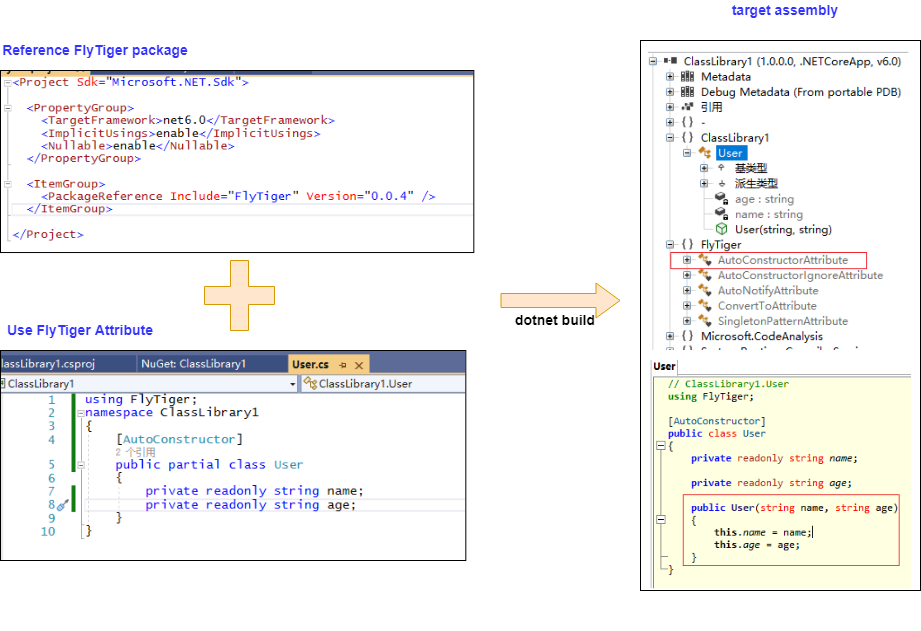

# FlyTiger

> FlyTiger is a dotnet source generator class library. It provide several useful features to make coding on c# more easier.


[](https://codecov.io/gh/yscorecore/FlyTiger) 
[](https://nuget.org/packages/FlyTiger/) 
[](https://github.com/yscorecore/FlyTiger/blob/master/LICENSE)
[](https://sonarcloud.io/summary/new_code?id=yscorecore_flytiger)


## How it works

FlyTiger use [Source Generator](https://docs.microsoft.com/en-us/dotnet/csharp/roslyn-sdk/source-generators-overview) to emit C# source code during compilation. It generate both feature code and attribute class code to output assembly, so the target assembly doesn't depend on the `FlyTiger` assembly in runtime.  


## Features
- [AutoConstructor](https://yscorecore.github.io/flytiger/features/AutoConstructor.html) (通过一个特性，自动生成构造函数)
- [ConvertTo](https://yscorecore.github.io/flytiger/features/ConvertTo.html) (最高效的模型类相互转化方案，支持EFCore)
- [SingletonPattern](https://yscorecore.github.io/flytiger/features/SingletonPattern.html) (定义单例模式的最简单的方式)
- [AutoNotify](https://yscorecore.github.io/flytiger/features/AutoNotify.html) (自动生成PropertyChanged事件)
## How to use
1. Add `FlyTiger` package in your csharp project.
    ```bash
    dotnet add package FlyTiger 
    ```

1. Use attribute class
    ```csharp
    using FlyTiger;
    namespace ClassLibrary1
    {
        [AutoConstructor]
        public partial class User
        {
            private readonly string name;
            private readonly string age;
        }
    }
    ```
    More usage please goto the [document](https://yscorecore.github.io/flytiger/).


## Maintainers
[@Pengbo Yang](https://github.com/obpt123)


## Contributing

Feel free to dive in! [Open an issue](https://github.com/yscorecore/flytiger/issues/new) or submit PRs.

Standard Readme follows the [Contributor Covenant](http://contributor-covenant.org/version/1/3/0/) Code of Conduct.

### Contributors

This project exists thanks to all the people who contribute. 

<a href="https://github.com/yscorecore/flytiger/graphs/contributors">
  
</a>


## License

[MIT](LICENSE) © Pengbo Yang


